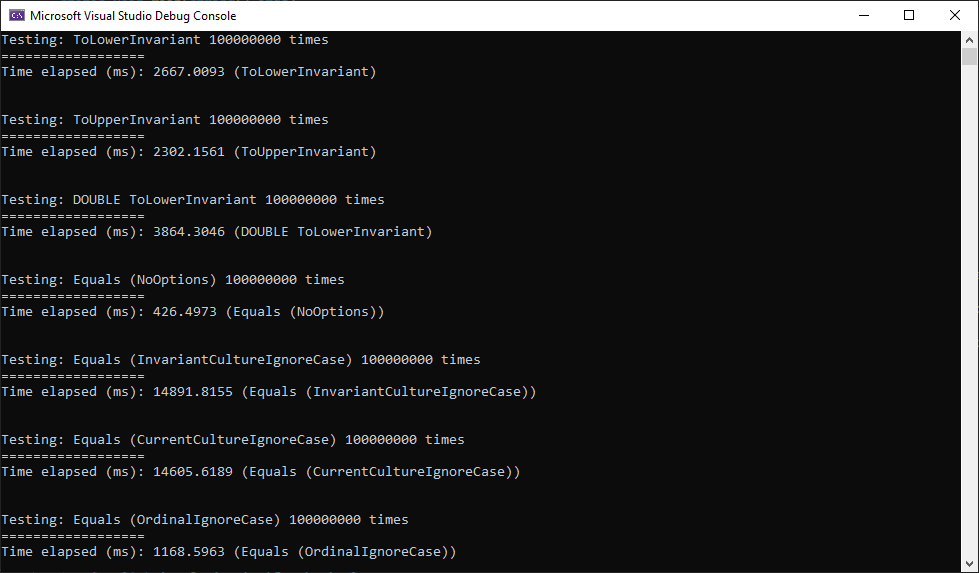

# StringEqualsSpeedTests

A lot of people use ```ToLower()``` or ```ToLowerInvariant()``` to normalise their strings before comparing them with ```==```, STOP IT.

This is very slow, and while that may not matter for 1 or 2 string comparasons, it mounts up in large projects.

This test aims to show what we should be using instead.

Each test was ran 100,000,000 times, which is a realistic number of records that could be compared in a loop.

| Test                                    | Time in ms  |
| --------------------------------------- | ----------- |
| ToLowerInvariant                        | 2667        |
| ToUpperInvariant                        | 2302        |
| DOUBLE ToLowerInvariant                 | 3864        |
| Equals (NoOptions) (as a control test)  | 426         |
| Equals (InvariantCultureIgnoreCase)     | 14891       |
| Equals (CurrentCultureIgnoreCase)       | 14605       |
| Equals (OrdinalIgnoreCase)              | 1168        |

As you can see, Equals with "OrdinalIgnoreCase" is an order of magnitude faster than InvariantCultureIgnoreCase, and about twice as fast (half as slow) as ToLowerInvariant. Stop using Invariant unless you absolutely understand your use case for it.


